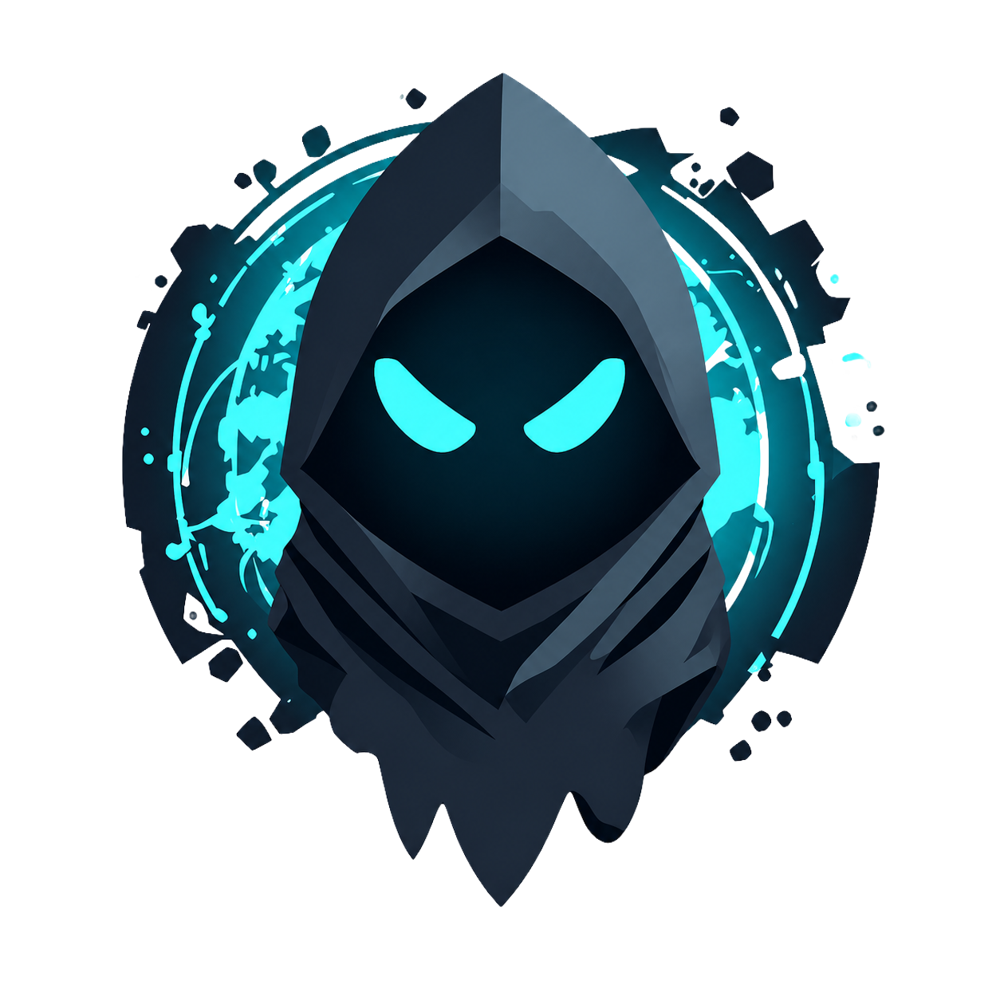

<div align="center">



# GhostWire

**An all-in-one OSINT workbench for your desktop.**

Sock puppets with isolated browser sessions · a Maltego-style link graph · investigations · a built-in browser · curated tools & API integrations · Markdown notes that export to Obsidian.

[](https://github.com/AsleepCoffee/Ghostwire/releases/latest)
[](https://github.com/AsleepCoffee/Ghostwire/releases)
[](LICENSE)


</div>

---

## ⬇️ Download

Grab the latest Windows installer from the **[Releases page](https://github.com/AsleepCoffee/Ghostwire/releases/latest)** (`GhostWire-Setup-x.y.z.exe`), run it, and you're set. The app keeps itself up to date automatically — when a new version is published it offers to **install now** or **skip for now**, and you can check manually under **Settings → Updates**.

> The installer isn't code-signed, so Windows SmartScreen may show a “more info → run anyway” prompt on first launch. That's normal for indie apps without a paid signing certificate.

## ✨ Features

- **🎭 Sock Puppet Manager** — build personas with full identity details, **random AI-face avatars**, linked accounts with credential autofill, and a one-click identity + password generator. Each persona gets a **fully isolated browser session** (be logged into the same site as several identities at once), can provision a **disposable mailbox** (mail.tm, with a built-in inbox) or use your own **catch-all domain**, and tracks which accounts are created vs. still to make.
- **🌐 Embedded Browser** — a real tabbed Chromium browser with a per-tab persona switcher. **Capture any page to evidence** (URL + UTC timestamp + SHA-256, filed to the active investigation). Sites that block embedding fall back to your system browser in one click.
- **🕵️ Investigations** — a workspace per target (person or company). Capture structured **known information**, pivot on any of it, drop findings onto a link chart, attach **evidence**, keep an **activity log** (methodology trail), and **export a Markdown report**. Group personas, notes, and boards under each case.
- **🕸️ Graph Workspace** — a Maltego-style canvas with **transforms that pull real data into the graph** (right-click a node): crt.sh subdomains, DNS & Wayback, live username enumeration, EXIF→location, and API-powered enrichment (VirusTotal, Shodan, Hunter, AbuseIPDB, IPinfo). Auto-dedupe, and **export the chart as a PNG**.
- **🎯 Dork & Pivot** — a Google-dork builder plus a pivot engine that, for any value (email, username, domain, IP, name…), opens the right lookups — including the API tools you hold a key for, deep-linked per data type.
- **🧰 Tools & API Integrations** — a curated launcher of OSINT tools, plus integrations that unlock when you add a free or paid API key (VirusTotal, Shodan, AbuseIPDB, urlscan, IPinfo, Hunter, Censys, and more) — with a **Test** button for each key.
- **📝 Notes** — Markdown notes with live preview, folders, tags, and image paste — **one-click export to your Obsidian vault** with YAML frontmatter.
- **🎨 10 full-app themes**, a custom themed window frame, themed dialogs, and auto-updates from GitHub releases.

All data is stored **locally** in a SQLite database in your app-data folder. Nothing leaves your machine unless you explicitly use a tool or API.

## 🔒 Privacy & security

- Everything lives locally (SQLite + Markdown). GhostWire has no backend and phones home only to GitHub to check for updates.
- Persona credentials, API keys and mailbox passwords are stored **unencrypted** in the local database — enable OS full-disk encryption (e.g. BitLocker) and keep your device secured.

## ⚖️ Responsible use

GhostWire is for **authorized, lawful OSINT** — security research, investigations you're permitted to run, CTFs, journalism, and education. You are responsible for complying with the terms of service of any site you access and with the laws of your jurisdiction. Don't use it to harass, stalk, or harm.

## 🛠️ Development

Requires Node.js 20+.

```bash
npm install        # install dependencies
npm run dev        # launch with hot reload
npm run build      # production build into ./out
npm run start      # preview the production build
npm run build:win  # build a Windows installer into ./dist
```

GhostWire is **Electron + React + TypeScript** (electron-vite), styled with **Tailwind CSS**, using **sql.js** (WebAssembly SQLite — no native build step), **@xyflow/react** for the graph, and **react-markdown** for notes.

```
src/
  main/        Electron main — window, SQLite DB, IPC, media, mail, updater, API tests/EXIF, export
  preload/     contextBridge API exposed to the renderer as window.api
  renderer/    React app
    src/
      pages/       Dashboard, Investigations, Graph, Tools, Dork, Browser, Notes, Settings
      components/  TitleBar, Sidebar, Topbar, dialogs, shared UI
      lib/         API wrapper, pivot/transform engines, themes, settings, constants
  shared/      Types shared between main and renderer
```

## 📦 Releases

Releases are built and published automatically by GitHub Actions when a version tag is pushed:

```bash
# bump "version" in package.json, then:
git tag -a v0.2.0 -m "GhostWire v0.2.0"
git push origin v0.2.0
```

The workflow builds the Windows installer and attaches it (plus `latest.yml` for auto-update) to a GitHub Release, with notes pulled from [`CHANGELOG.md`](CHANGELOG.md).

## 📄 License

[MIT](LICENSE) © GhostWire contributors

